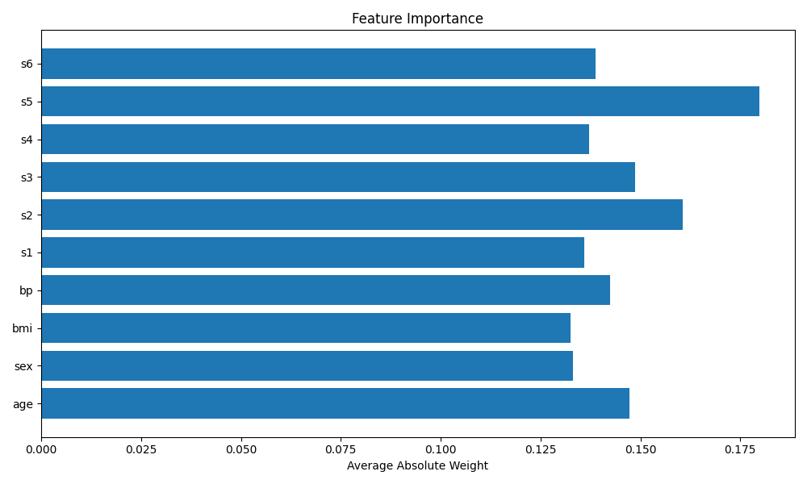
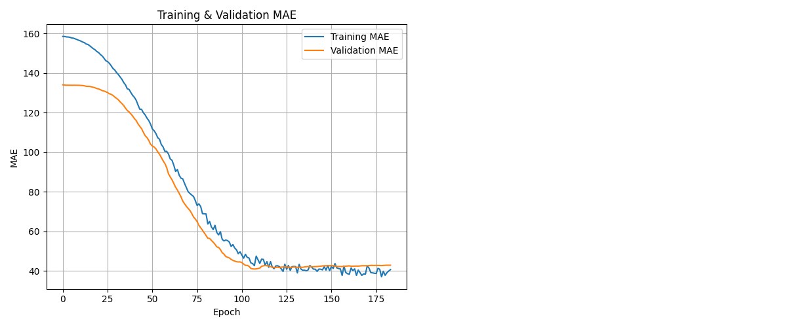
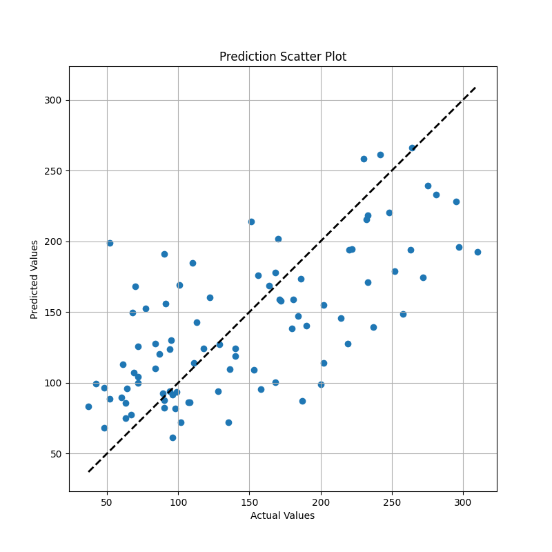

# 🩺 diabetes-ml

A complete machine learning pipeline for predicting diabetes progression using FastAPI, TensorFlow (Keras), PostgreSQL, Docker, AWS (S3 + RDS), and Terraform.

This project showcases how to train a regression model, serve it as an API, and deploy it with cloud infrastructure – all production-ready and containerized.

---

## 🚀 Features

- ✅ **ML model** trained with TensorFlow (Keras) on diabetes dataset
- ✅ **Scaler saved** for consistent inference
- ✅ **FastAPI REST API** for real-time predictions
- ✅ **S3 model loading** in containerized app
- ✅ **PostgreSQL logging** of predictions for audit/monitoring
- ✅ **Dockerized API** for reproducible deployment
- ✅ **Terraform infrastructure** (EC2, RDS, IAM, S3) for AWS

---

### 🧠 ML Training Pipeline

Trained regression model that uses TensorFlow (Keras) on the classic diabetes dataset (`442 samples`, `10 features`).

#### 🔧 Techniques Used

- **Model architecture**: 2 hidden layers with ReLU, batch normalization, dropout, and L2 regularization
- **Callbacks**:
  - Early stopping (patience = 30)
  - ReduceLROnPlateau for dynamic learning rate adjustment
- **Data**: StandardScaler applied to features
- **Artifacts saved**:
  - `tf_model.h5` – trained model
  - `scaler.pkl` – fitted scaler
  - Visualizations: feature importance, training history, prediction scatter

---

### ☁️ AWS Integration

This project uses several AWS services:

- **Amazon S3** – to store trained model and scaler (`.h5`, `.pkl`)
- **Amazon RDS** – to log API predictions with timestamps and metadata
- **IAM** – to separate programmatic access (via environment)
- **Optional (future)**: EC2, CloudWatch, ElastiCache, Secrets Manager

Model and scaler are dynamically loaded from S3 with script.  
All S3 uploads are managed by a dedicated upload script using `boto3`.

---

### 📊 Visualizations & Analysis

#### 1. Feature Importance

Shows which features the model considered most influential based on the absolute weights of the first layer:

#### 2. Training & Validation MAE

Model converges nicely without overfitting – early stopping helps retain generalization:

#### 3. Prediction Scatter Plot

Visual comparison of predicted vs actual values on the test set:

- Predictions generally follow the diagonal line (ideal prediction), especially for values below 150.
- There's noticeable spread in higher values (>200), indicating that the model struggles more in that range.
- Outliers show some samples with significant prediction errors.
- This is likely due to the **small dataset size (442 samples)**, which limits generalization capacity.